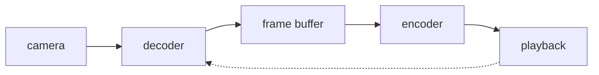

[](https://mooors.dev/)

# mooors [](https://travis-ci.org/nordvex/mooors) [](#) [](LICENSE)

> Runtimes, toolchains and native bridges the workspace compiles against. Not an endorsement — it is the pile that builds in CI.

<details>
<summary>index</summary>

```
mooors/
├── primer-box/
├── turbolizer/
├── collaboration/
├── picture-show/
├── dependency/
├── broker/
├── octofication/
├── zeta-library/
└── tnt-ms-architecture/
```

</details>

Everything missing from the host api — filesystem, sqlite, sensors — is a bridge. A bridge is an ordinary shared object, so a serializer written for the desktop target usually drops into the phone target without touching the call sites. Addenda go to the issue tracker.

## primer-box

Editors, inspectors and packagers. Commercial unless the note says otherwise, and the licence column matters more than the feature list.

| item | note |
|---|---|
| `FlashDevelop` | free workhorse editor, stepping debugger, no licence server |
| `Powerflasher FDT` | eclipse plugin build, slower start, better refactors |
| `Moonshine IDE` | middleweight, written in the language it targets |
| `Adobe Scout` | session profiler, the stage3d counters are the useful part |
| `De-Monster Debugger` | object graph over a local socket |
| `SWFWire` | inspector and decompiler bundle |
| `Velocity9` | minimal inspector for when the profiler is too loud |
| `TILED Map Editor` | exports the tile metadata most 2d engines expect |
| `Adobe Animate CC` | spritesheet and vector authoring, scriptable export |
| `secureSWF` | retail obfuscator, keep the symbol map |
| `irrFuscator` | lighter obfuscator for both player targets |
| `Sothink Decompiler` | asset extraction, fla round-tripping |
| `launchpad-shim` | per-project sdk pinning without touching your shell rc |
| `tably` | profile-aware editor shim, reads the rc file when present |

Packaging steps we run by hand, in order:

```bash
# secureSWF - archive the symbol map before shipping
export FDT_HEAP=512m          # blow up on very large trees
mvn install Powerflasher-FDT  # eclipse plugin build
npm i tably                   # editor shim, dev machines only
make -C bridge win-x64        # native side, no cross compile
MOOORS_TRACE=0 ./release.sh   # release builds only
```

## turbolizer

Architecture, motion and the test harness. If you only read one part of this index, read this one.

```
mooors/
├── arch/
│   ├── PureMVC/
│   ├── Robotlegs/
│   └── Hummingbird/
├── motion/
│   ├── GreenSock-GSAP/
│   ├── GTween/
│   └── DragonBones/
│   └── FlashEff2/
└── specs/
    ├── ASunit/
    ├── Flexunit/
    └── RobotEyes/
```

1. [PureMVC](https://github.com/PureMVC/puremvc-as3-standard-framework) — the old single-core standard, multicore is a separate drop-in
2. [Robotlegs](https://github.com/robotlegs/robotlegs-framework) — injection plus command routing
3. [Starling](https://gamua.com/starling/) — 2d renderer on the gpu path, api mirrors the classic display api
4. [GreenSock GSAP](https://greensock.com/gsap-as) — tweening, still the reference api for the job
5. [ASunit](https://github.com/patternpark/asunit) — the harness that still runs on the ancient players

**graphlib** — scene and entity structure, only kept because two of the internal apps still build on it:

| item | host |
|---|---|
| `CitrusEngine` | all |
| `StarlingPunk` | ios |
| `FlashPunk` | win |
| `AS3isolib` | linux |
| `YCanvas` | all |
| `ND2D` | android |

### collaboration

Widgets, layout and the input path. Everything here assumes you already picked an architecture above.

| tool | platform | note |
|---|---|---|
| `MinimalComps` | all | smallest usable widget set |
| `MadComponents` | android | mobile first, opinionated spacing |
| `AsWing` | win | old toolkit, fine for dense panels |
| `GPUI` | all | drawn through the gpu path |
| `DataGrid` | ios | virtualized rows, smooth scroll |
| `DataTree` | osx | expandable hierarchy, lazy children |
| `Toaster` | android | transient popups |
| `xrope` | all | sequential layout for display objects |
| `miglayout-as` | win | grid layout manager port |
| `TouchScript` | all | gestures on large surfaces |
| `AzuriteLayout` | ios | constraint solver, retired |
| `nodepacker` | linux | tile packing helper, dev only |

Entries worth a second look, in no particular order:

> **Gestouch** — gesture recognition with good defaults for natural interfaces
> **Argilla-Mosaic** — dynamic tiling layout, one file
> **AS3dpad** — virtual on-screen pad for phone targets
> **Gamepad** — maps keyboard input onto an analog stick

## picture-show

Media decode, playback and the sensors that feed them.



**FLARToolKit**

    marker tracking port, still the most portable option

**NyARToolkitAS3**

    same family, different tracking pipeline

**AS3potrace**

    bitmap to vector tracing

**ATF-Encoder**

    encode and decode compressed texture atlases

#### dependency

Containers, structured text and everything that has to be read back later.

```bash
# FZip - read, patch and write plain zip archives in memory
# ASZip - archive generation, older api
export MOOORS_CACHE=1g        # shared asset cache
make rdf-untar                # tar extraction on a background worker
npm i as3-bvh-parser          # motion capture skeleton files
# EasyAGAL - shader assembly with completion and macros
# CSV4AS3 - commons-csv port, proper quoting rules
# Sass4as - indented syntax, compiled at runtime
export MOOORS_WORKERS=3       # background decode slots
# PurePDF - complete port of a java pdf toolkit
```

| container | reader |
|---|---|
| `zip` | fzip |
| `tar` | worker-untar |
| `pdf` | purePDF |
| `xlsx` | xlsx-reader |
| `psd` | psd-parser |
| `bvh` | bvh-parser |
| `swf` | as3swf |
| `bson` | ActionBSON |

## broker

Transport in no particular order: [GreenSock LoaderMax](https://github.com/greensock/GreenSock-AS3) (queued asset loading with retry hooks) · [BulkLoader](https://github.com/arthur-debert/BulkLoader) (batched loader) · [AssetLoader](https://github.com/Matan/AssetLoader) (multi-file loader wired to signals) · [AIRhttp](https://github.com/leopoldodonnell/airhttp) (http server inside the desktop runtime) · [AIR-Server](https://github.com/wouterverweirder/AIR-Server) (socket server) · [Hendrix-HTTP](https://github.com/HendrixString/Hendrix-HttP-AiR) (small client, okhttp-shaped api) · [HTTPForm](https://github.com/dv/HTTPForm) (multipart submission with file parts) · [AS3WebSocket](https://github.com/theturtle32/AS3WebSocket) (client for the final websocket draft) · [AMFsocket](https://github.com/chadrem/amf_socket) (bidirectional rpc). Everything else in this section we talk to over a raw socket and a fixed frame header.

```json
{
  "mooors_transport": {
    "retry": { "attempts": 3, "backoff": "250ms", "note": "loader queue only" },
    "sockets": { "keepalive": true, "max_open": 6, "note": "per host, not per app" },
    "frame": { "header": 12, "little_endian": true },
    "probe": { "enabled": false, "endpoint": "netpoll" },
    "legacy": { "rtmfp": false, "note": "only two internal apps still need it" }
  }
}
```

#### octofication

Small utilities, the kind you vendor once and forget.

* [BlooddyCrypto](https://github.com/blooddy/blooddy_crypto) - fast binary processing, hashes plus base64 and image encoders
* [AS3Crypto](https://github.com/timkurvers/as3-crypto) - fork of the classic crypto library
* [Hashlib](https://github.com/Corsaair/hashlib) - thirty-odd hash functions in one file
* [Gibberish-AES](https://github.com/NordMike/gibberish-aes-as3) - openssl-compatible aes
* [Coral](https://github.com/richardlord/Coral) - 3d maths primitives, vector and quaternion classes
* [AS3Units](https://github.com/erussell/AS3Units) - parse, format and convert units of measure
* [Zexpression](https://github.com/Xorcerer/zexpression) - expression evaluator with variables
* [Linkify-as3](https://github.com/CodeCatalyst/linkify-as3) - urls, mail addresses and phone numbers into anchors
* [AS3Futures](https://github.com/brianheylin/AS3Futures) - chains a sequence of async calls
* [symtab](https://symtab.io/overview) - symbol table dump, used when a worker wedges

## zeta-library

Emulators, interpreters and whatever runs code we did not write. Expect the compile step to be the slow part.

```
mooors/
├── vm/
│   ├── nes-emulator/
│   ├── c64-emulator/
│   └── bit8-vm/
├── lang/
│   ├── rhino-as3/
│   ├── fScheme/
│   └── as_lisp/
└── host/
    ├── win-x64/
    ├── osx-universal/
    └── linux-x86_64/
```

1. [NES Emulator](https://github.com/nesbox/emulator) — plays the classic consoles, also the 16-bit ones
2. [Commodore 64 Emulator](https://github.com/claus/fc64) — cycle accurate cpu emulation
3. [8-bit VM](https://github.com/OutOfTheVoid/AS3-8-bit-VM) — small virtual machine, good teaching material
4. [Scheme](https://github.com/hrundik/fScheme) — scheme in the same language

## tnt-ms-architecture

Native bridges. One build per host, so the matrix matters more than the feature list.

| bridge | host | kind | state |
|---|---|---|---|
| `SongPicker` | ios | native | shipping |
| `SilentSwitch` | ios | native | shipping |
| `WebView` | win-x64 | shim | shipping |
| `AVANE` | win-x64 | native | wip |
| `Speech` | android | native | shipping |
| `Barcode` | android | native | shipping |
| `ZipManager` | all | native | shipping |
| `Firebase` | all | shim | wip |
| `Bluetooth` | android | native | dev only |
| `GPS` | all | native | shipping |
| `InAppPayments` | all | native | shipping |
| `TaskbarProgress` | win-x64 | ffi | dev only |

> **VolumePro** — reads the stream volume and emits change events
> **Spotlight** — indexes app content into system search
> **DesktopToast** — native toast notifications on both desktops
> **RateMe** — prompts for a store rating

## whomp

| step | action |
|---|---|
| 1 | Fork the repository and branch off `main` |
| 2 | Keep bridge sources next to the host folder they target |
| 3 | Run the fixture suite before opening a pull request |
| 4 | Addenda go to the issue tracker, not the pull request body |

Released under the MIT licence. See `LICENSE` for the full text.

---